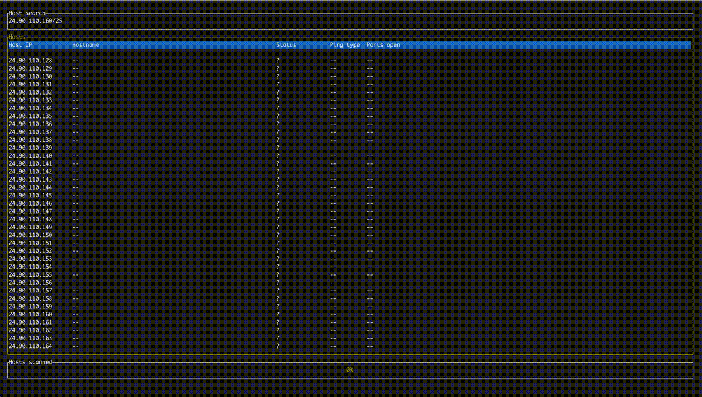

findi
======
Probe your local network for live hosts and open ports. Check out the [roadmap](doc/roadmap.md) for future features. Currently only supports local IPv4 addresses.



# Build
You'll need `rustup` and `cargo` installed locally to build. See [here](https://doc.rust-lang.org/cargo/getting-started/installation.html) for instructions.

## With UI
```bash
cargo build --features "ui"
```
Or to run with a specific IPv4 CIDR range:
```bash
cargo run --features "ui" -- 192.168.0.0/24
```
